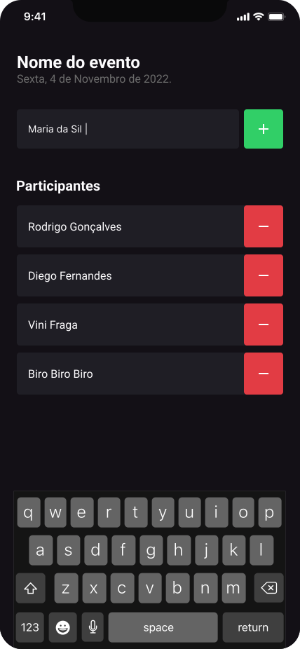
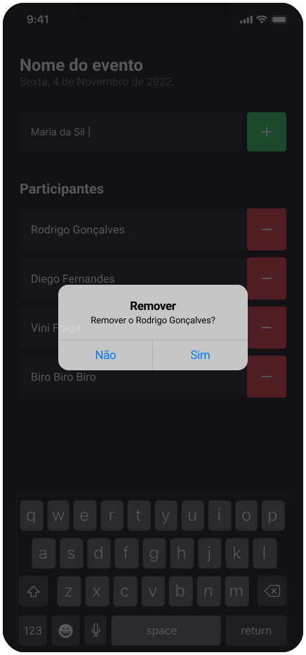

<h4 align="center">
  ImHere
</h4>

<h4 align="center">
    <p align="center">
      <a href="#-about">About</a>&nbsp;&nbsp;&nbsp;|&nbsp;&nbsp;&nbsp;
      <a href="#-technologies">Technologies</a>&nbsp;&nbsp;&nbsp;|&nbsp;&nbsp;&nbsp;
      <a href="#-how-to-run-the-project">Run</a>&nbsp;&nbsp;&nbsp;|&nbsp;&nbsp;&nbsp;
      <a href="#-info">Info</a>&nbsp;&nbsp;&nbsp;|&nbsp;&nbsp;&nbsp;
      <a href="#-license">License</a>
  </p>
</h4>

<h1 align="center">
    

  <div style="display: flex; flex-direction: row; align: center;" align="center">
    
    
  <div>
</h1>

## 🔖 About

IamHere é um aplicativo desenvolvido em React Native utilizando a biblioteca Expo. Ele foi projetado para fornecer uma solução simples e intuitiva para listar os participantes de um evento. O aplicativo permite aos usuários adicionar participantes, visualizar a lista completa e remover participantes.

O aplicativo oferece um campo de entrada de texto onde os usuários podem inserir o nome do participante a ser adicionado à lista. Ao tocar no botão "+", o participante é incluído na lista exibida na tela principal.

Os participantes são exibidos em uma FlatList, fornecendo uma visualização organizada e eficiente. Cada item da lista exibe o nome do participante adicionado. A lista é atualizada em tempo real conforme os usuários adicionam ou removem participantes.

Os usuários podem remover participantes da lista ao tocar no botão de remoção associado a cada item da FlatList. Isso permite uma gestão flexível da lista, permitindo que os usuários eliminem participantes que não são mais relevantes.

## 🚀 Technologies

- [ReactNative](https://reactnative.dev/)
- [Typescript](https://www.typescriptlang.org/)
- [Expo](https://expo.dev/)

## 🏁 How to run the project

```sh
# Clone the repository
git clone https://github.com/rafinhaa/imhere.git
cd imhere

# Install the dependencies
yarn install

# Make a copy of '.env.example' to '.env'
cp .env.example .env

# Start the Android application
yarn android

# Start the iOS application
yarn ios
```

## ℹ️ Info

## 📄 Changelog

## 📝 License

[MIT](LICENSE.txt)

**Free Software, Hell Yeah!**
